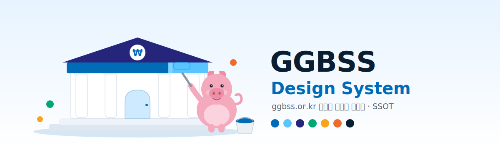

<p align="center">
  
</p>

# GGBSS Design System

ggbss.or.kr(**함께만드는세상** — 사회연대은행 부설)의 본·서브도메인이 공유하는 **라이브 디자인 시스템 단일 진실원(SSOT)**.

> ⚠️ **`BSS Design System`(shadcn 기반 별도 레포·Claude Design 프로젝트)과는 다른 시스템입니다.** GGBSS는 실제 운영 중인 ggbss.or.kr의 *CSS 변수 + CSS Modules* 기반 시스템을 정본화한 것으로, 두 시스템은 아이디어가 달라 **통합하지 않고 별도 관리**합니다.

## 무엇이고, 누가 쓰나
- ggbss.or.kr 라이브 사이트에서 추출·정규화한 **토큰·규칙·컴포넌트 카탈로그**의 단일 출처.
- 사람이 읽는 매뉴얼이자, **Claude Design / Claude Code가 GitHub에서 import**해 모든 작업에 일관 적용할 수 있는 가져오기용 SSOT.
- 디자이너·PM은 `docs/design.md`를, 에이전트는 `CLAUDE.md`(가드레일)와 `tokens/`를 본다.

## 레포 구성
```
ggbss-design-system/
├── assets/banner.svg     대문 이미지
├── README.md             이 문서
├── CLAUDE.md             에이전트 가드레일 (토큰만·min-14·8그리드·고정다크 예외)
├── tokens/
│   ├── tokens.css        base 토큰 SSOT — 색·타입스케일·간격·반경·그림자·라인·그라디언트 + 다크 플립
│   └── globals.css       semantic alias·버튼 기본·base reset·다크 재고정
├── docs/
│   ├── design.md         정본 매뉴얼 (원칙·surface matrix·다크모드·금지 규칙, 360줄)
│   └── components.md      27개 컴포넌트 카탈로그
└── drift/
    └── rules.md          린트 규칙 (R1~R5 자동 + C1~C7 리뷰)
```

## 토큰 (요약 — 전체는 `tokens/tokens.css`)
**타입 스케일 (8-grid, 2026-06-20 정규화)**

| 토큰 | px | 용도 | 토큰 | px | 용도 |
|---|---|---|---|---|---|
| `--fs-h1` | 64 | 히어로 | `--fs-body` | 18 | 본문 |
| `--fs-h2` | 56 | 페이지 대제목 | `--fs-caption` | 16 | 캡션·표·컨트롤 |
| `--fs-h3` | 40 | 섹션·페이지 제목 | `--fs-tagline` | 14 | 라벨·칩 (최소 floor) |
| `--fs-h4` | 24 | 카드·패널 제목 | `--fs-display` | 48 | 점수·대표 수치 |
| `--fs-h5` | 20 | 소제목 | `--fs-stat` / `-lg` | 34 / 38 | data 통계 |

**색** — 브랜드 `--c-primary`(#006CB7)·`--c-dark-blue`(#26257C)·`--c-sky`(#58C5FF)·`--c-sky-light`(#CDEAFF) / 중립 `--c-ink-deep`·`--c-body`·`--c-grey`·`--c-light-grey`·`--c-canvas` / 시맨틱 `--c-positive`·`--c-warning`·`--c-negative`·`--c-danger` / `--c-rank-*`·`--c-badge-*`. 다크는 `[data-theme="dark"]`에서 base 토큰 자동 플립.

**간격** `--sp-xs`(4) … `--sp-7xl`(160) — 4·8 그리드. **반경** `--r-xs`(4)·`--r-ctl`(8)·`--r-lg`(12)·`--r-xl`(16)·`--r-pill`. **글꼴** `--ff`=Pretendard · `--ff-en`=Satoshi, 자간 -0.01em.

## 컴포넌트 (27개 — 전체는 `docs/components.md`)
| 그룹 | 컴포넌트 |
|---|---|
| 컨트롤·폼 | button · input · select-controls · fieldset · search · keyboard |
| 컨테이너·표면 | card · context-card · doc-card · section · hero · entity |
| 데이터 | table · gauge · calendar |
| 피드백·오버레이 | notice · feedback · tooltip · drawer · menu · command-menu · floating-cta |
| 내비·구조 | nav-flyout · accordion · file-tree |
| 콘텐츠 | badge · code-block |

라이브 쇼케이스: **[design.ggbss.or.kr/design/components](https://design.ggbss.or.kr/design)**.

## 출처
- **라이브 구현체** (정본 소스): [`SocialSolidarityBank/ggbss-web`](https://github.com/SocialSolidarityBank/ggbss-web) — `web/app/_v2/tokens.css` · `web/app/globals.css` · `web/app/(chrome)/design/**`.
- **렌더 매뉴얼**: [design.ggbss.or.kr](https://design.ggbss.or.kr/design).
- **정규화 이력**: ggbss-web PR [#126](https://github.com/SocialSolidarityBank/ggbss-web/pull/126)(토큰 정규화·font-size 전면 토큰화)·[#127](https://github.com/SocialSolidarityBank/ggbss-web/pull/127)(후속 픽스).
- 이 레포는 라이브의 **정규화 스냅샷**이며, 변경은 라이브 → 이 레포 순으로 반영한다.

## 사용 / 가져오기
1. **Claude Design** — 이 레포를 design-system 프로젝트로 import → 모든 작업에 자동 적용.
2. **Claude Code** — `/design-sync`로 컴포넌트 단위 동기화.
3. **사람** — `docs/design.md`가 정본 매뉴얼, `CLAUDE.md`가 규율.

## 관리 원칙
토큰만(리터럴 금지) · 최소 폰트 14px · 8그리드 타입스케일 · 색은 토큰 참조로 다크 자동 대응(고정-다크 표면은 예외 주석). 자세히는 [`CLAUDE.md`](CLAUDE.md)·[`drift/rules.md`](drift/rules.md).
